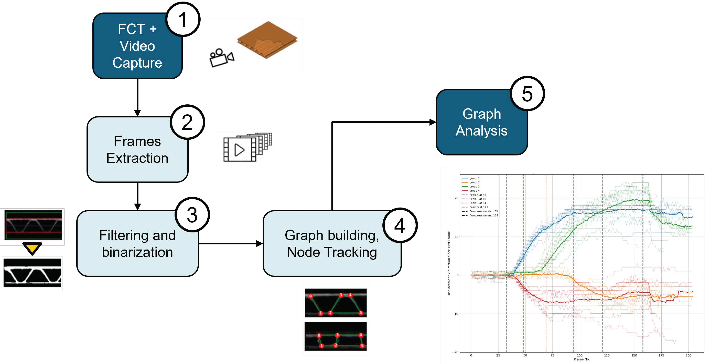
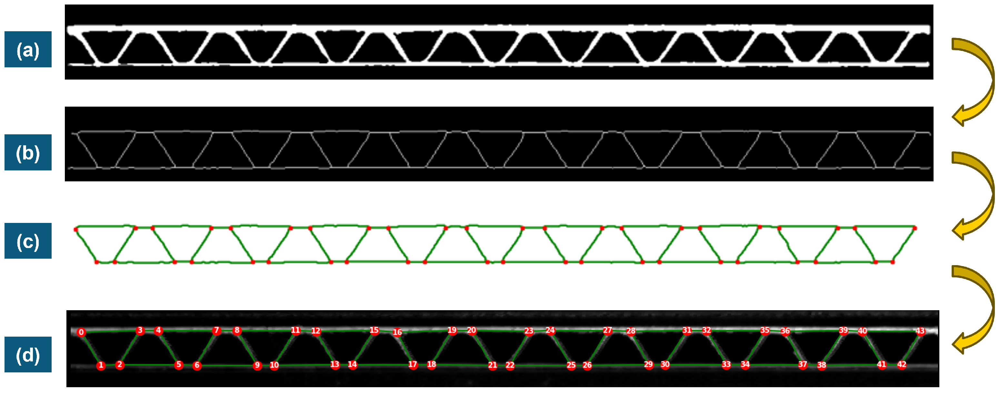

<div align="center">

# Graph_CB  
### Graph-Based Characterization of Corrugated Board Compression

**Related paper:** *Graph-Based Analysis for the Characterization of Corrugated Board Compression* (Materials, 2024)

</div>

<br/>

<div align="center">
  
</div>

---

## 📌 Overview

This repository contains the research code and data organization used to extract and analyze **graph representations** of corrugated board structures during compression tests. The pipeline processes video frames, performs image preprocessing and skeletonization, builds a **network graph** from the skeleton, applies **graph filtering / simplification rules**, tracks nodes across frames, and exports quantitative results (displacements, thickness evolution, graphs, figures).

The implementation is aligned with the methodology described in the accompanying paper.

---

## ✨ Highlights

- Video → Frames → Skeleton → Graph pipeline for corrugated board geometry tracking.
- Robust graph simplification to remove spurious micro-cycles, triangles, and leaf branches while preserving main trapezoid cycles.
- Node tracking across frames using distance-based association.
- Export of:
  - graphs (`.pkl`)
  - node tracking tables (`.xlsx`)
  - per-node displacement histories (`.csv`)
  - graph visualizations (`.png`)

---

## 📂 Repository structure

```text
Graph_CB/
├─ images/
│  ├─ graphical_abstract.png
│  └─ figure_9.png
├─ data/
│  ├─ Analysis_Ex1/
│  ├─ Analysis_Ex2/
│  ├─ Analysis_Ex3/
│  ├─ Analysis_Ex4/
│  ├─ Analysis_Ex5/
│  ├─ data_Exp3/
│  ├─ data_Exp4/
│  ├─ data_Exp5/
│  ├─ data_Probe1_22_v1/
│  ├─ data_Probe2_7_v1/
│  ├─ Sample_videos/
│  ├─ Combination_code.py
│  ├─ Combination_code_v2.py
│  ├─ Combination_code_v3.py
│  ├─ Combination_code_v4.py
│  └─ Combination_code_v5.py   <- latest / recommended
├─ requirements.txt
├─ .gitignore
└─ README.md
```

> **Note:** The `/data` folder contains data + scripts for each case (1–5), because case-specific constants differ.

---

## ⚙️ Installation

### Option A — venv (recommended)
```bash
python -m venv .venv
# Windows (PowerShell)
.venv\Scripts\Activate.ps1
pip install -r requirements.txt
```

### Option B — conda
```bash
conda create -n graph_cb python=3.10 -y
conda activate graph_cb
pip install -r requirements.txt
```

---

## ▶️ Usage

### 1) Pick the case you want to run
Each case has slightly different constants and inputs. The latest script is:

- `data/Combination_code_v5.py`

### 2) Ensure inputs exist next to the script you run
The script expects (relative paths):
- the **compression video(s)** (e.g., under `Sample_videos/`)
- the **load–deformation curves** Excel file `Load_Deformation_Curves.xlsx` with a matching sheet name (e.g., `Ex5`)

### 3) Configure key variables inside `Combination_code_v5.py`
In the top configuration block:
- `sample_name` (e.g., `Exp5`)
- Excel sheet name used in `pd.read_excel(..., sheet_name="Ex5")`
- `fps_div` (frame subsampling factor)
- `Ske_thin_method` (`True` = `skeletonize`, `False` = `thin`)
- optional rotation handling (`get_rotation_angle(...)`)
- masking/cropping constants (case-specific)

### 4) Run
From the folder where the script + inputs are available:

```bash
python Combination_code_v5.py
```

---

## 🧹 Node & graph filtering rules (implemented)

The graph filtering/simplification is designed to remove artifacts while preserving the main “trapezoid” cycles of the corrugated geometry.

### A) Skeleton cleanup before graph building
- Remove the **bottom plate line** detected as a long & thin connected component near the bottom of the skeleton.

### B) Cycle-aware simplification (small-cycle removal)
- Compute cycle areas and define a typical “trapezoid” area `A_med` from cycles with length ≥ 4.
- Define thresholds:
  - **Small cycles:** `area < small_area_ratio * A_med`
  - **Big cycles:** `len ≥ 4` AND `area ≥ big_area_ratio * A_med`
- Iterate:
  1. Select the **smallest** small cycle.
  2. Remove the **shortest edge** in that cycle that is **not** used by any big cycle.
  3. After removal, **contract endpoints** if they become degree-2 nodes **and** are not part of any big cycle.
- Stop when:
  - no small cycles remain, **or**
  - no safe edge exists, **or**
  - big cycles grow above a safety limit (`big_growth_tol`).

### C) Degree/path-based cleanup
- **Compress degree-2 paths** into single edges (border-aware).
- **Prune degrees**:
  - remove isolated nodes (degree 0),
  - remove degree-1 nodes away from borders,
  - contract degree-2 nodes away from borders.

### D) Triangle + leaf removal (post-pass)
- Remove **pure triangles** (triangles whose edges are not used by any other cycle), typically by removing the shortest edge.
- Remove **all degree-1 nodes** (iterative leaf pruning).

### E) Guarded removal of very short edges (optional utility)
- Remove short edges **only if** their endpoints remain connected after removal (i.e., the edge was redundant and part of a removable cycle).

### F) Node labeling consistency
- For the reference frame (frame 0), nodes are sorted left-to-right by x-position and relabeled sequentially for consistent downstream tracking/analysis.

---

## 📈 Outputs

Running `Combination_code_v5.py` creates an output folder like:

- `data_<sample_name>/<sample_name>_<meth>_rate<fps_div>/`

Common outputs include:
- `graphs_<test_info>.pkl` — list of per-frame graphs
- `Track_data_<test_info>.xlsx` — per-node tracking table across frames
- `nodes_in_two_frames_<test_info>.xlsx` — displacement summary at selected frames
- `node_displacements_vs_frame_<test_info>.csv` — per-node (dx, dy) time histories
- `graphs_figs_<test_info>/Graph_Frame_XXXX.png` — saved graph overlays / visuals
- `node_coordinates_frame0_pixels.csv` — frame-0 node pixel coordinates

---

## 🖼️ Included paper figures

The following images in `/images` are reproduced from the companion paper:
- Graphical abstract
- Figure 9

Please keep the citation in the next section when reusing/adapting them.

<div align="center">
  
</div>

---

## 📚 Reference (please cite)

If you use this code in academic work, please cite:

**Belfekih, T.; Fitas, R.; Schaffrath, H.-J.; Schabel, S.**  
*Graph-Based Analysis for the Characterization of Corrugated Board Compression.*  
**Materials** 2024, 17(24), 6083. DOI: 10.3390/ma17246083

### BibTeX
```bibtex
@article{Belfekih2024GraphCB,
  title   = {Graph-Based Analysis for the Characterization of Corrugated Board Compression},
  author  = {Belfekih, Taieb and Fitas, Ricardo and Schaffrath, Heinz-Joachim and Schabel, Samuel},
  journal = {Materials},
  year    = {2024},
  volume  = {17},
  number  = {24},
  pages   = {6083},
  doi     = {10.3390/ma17246083}
}
```

---

## 🔭 Future Works

- Expand the codebase to include **post-processing of images from another camera**, enabling multi-view or alternative imaging setups to be integrated into the same graph-based workflow.

---

## 📜 License

This repository is licensed under a **custom source-available, no-modification license**.

You are allowed to:

- View and read the source code.
- Cite this software (or its DOI, if provided) in academic work.

You are **not** allowed to:

- Modify, adapt, or debug this software.
- Redistribute this code or any modified version.
- Use this software for commercial purposes.
- Integrate any part of this code into other software projects.

For full legal terms, please refer to [LICENSE.txt](./LICENSE.txt).  
To request extended permissions, please contact the author (see below).

---

## 📧 Contact

For questions, collaboration, or permission requests, please contact:

- **Author**: Ricardo Fitas  
- **Email**: rfitas99@gmail.com  
- **GitHub**: [@ricardofitas](https://github.com/ricardofitas)
- **LinkedIn**: [Ricardo Fitas](https://www.linkedin.com/in/ricardo-fitas-167bba164/)

If you use or reference this code in academic work, please consider citing the corresponding publications once available.
